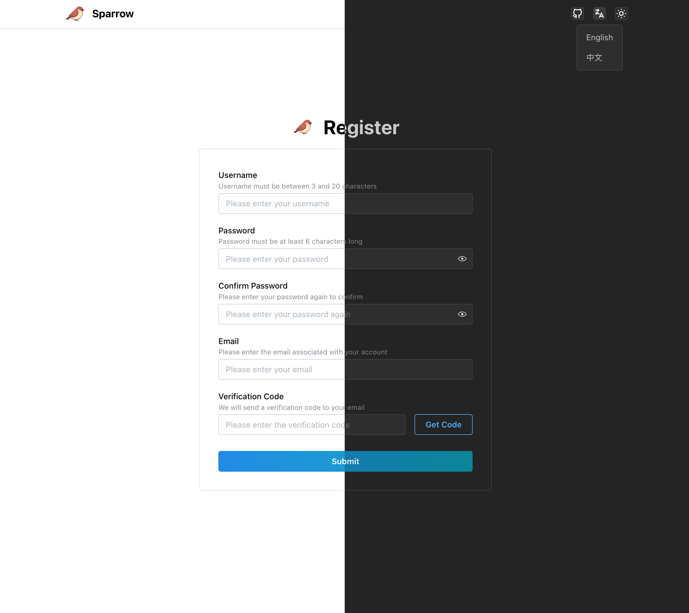

<div align="center">
  
  <h1>Sparrow</h1>
</div>

一个基于 Spring Boot 和 React 构建的轻量级全栈项目模板，适用于工具类系统、小型应用和管理后台。

## 项目简介
虽然 AI 已大大降低了开发应用的门槛，但构建一个结构清晰、可靠且可拓展的基础项目仍然需要有意识的架构设计、合理的技术选型以及丰富的实战经验。

Sparrow 是一个基于 Spring Boot 和 React 的轻量级全栈起步项目，旨在为工具系统、后台管理面板和小型应用提供一个简单、实用的起点。

希望帮助开发者减少搭建基础设施的工作量，专注于实现自己的想法。

## 项目截图


访问 [这个目录](documents/assets/screenshots/) 查看更多截图。

## 核心功能
- 亮色 / 暗色主题切换
- 用户登录和注册
- 用户密码重置和邮箱验证
- 简单的基于角色的访问控制
- 可配置的系统设置
- API 密钥认证
- 基本的 CRUD 操作（用户管理）

## 核心技术栈
### 后端
- Java 17
- [Spring Boot](https://spring.io/projects/spring-boot) 3.5.3
- [sa-token](https://github.com/dromara/Sa-Token) 1.44.0
- [mybatis-plus](https://baomidou.com/en/) 3.5.12

### 前端
- [React](https://react.dev/) ^19.1.0
- [Vite](https://vite.dev/) ^8.2.0
- [Mantine UI](https://ui.mantine.dev/) ^8.2.1
- [Mantine DataTable](https://icflorescu.github.io/mantine-datatable/) ^8.2.0
- [tabler icons](https://tabler.io/icons) ^3.34.0

## 部署
**默认用户名和密码是 `root` / `Root@123.`**

### 用 Docker 运行
你需要提前准备一个 MySQL 数据库。

[这里](documents/deployment/docker-run.sh)是一个示例 `docker run` 命令，你可以用它来运行 Sparrow 并连接到你自己的 MySQL 数据库。

### 用 Docker Compose 运行
**用 Docker Compose，你不用提前准备 MySQL 数据库，修改配置文件即可同时运行 Sparrow 应用和 MySQL 数据库。**

[这里](documents/deployment/docker-compose.yml)是一个示例 `docker-compose.yml` 文件，你可以用它来运行 Sparrow。


### 用 JAR 运行
**确保你已经在机器上安装了 Java 17。**

在[releases 页面](https://github.com/aizhimou/sparrow/releases)上下载最新的 JAR 文件，并使用 [这个](documents/deployment/jar-run.sh) 命令运行它。

## 开发
### 源代码目录结构
```
sparrow
├── backend  // 后端源码目录
│   ├── pom.xml  // Maven 配置文件
│   ├── src  // Java 源码目录
├── Dockerfile  // Docker Image 构建文件
├── documents  // 文档目录
│   └── deployment
├── frontend  // 前端源码目录
│   ├── eslint.config.js  // ESLint 配置文件
│   ├── index.html  // 主 HTML 文件
│   ├── package-lock.json  // NPM 锁定文件
│   ├── package.json  // NPM 配置文件
│   ├── public  // 公共资源目录
│   ├── src  // React 源码目录
│   └── vite.config.js  // Vite 配置文件
├── LICENSE
└── README.md

```

### 简单的基于角色的权限控制


所有接口支持通过 Token 或 API Key 进行统一角色鉴权。

## 开发
### 连接你自己的 MySQL 数据库
你可以在 backend/src/main/resources 目录下的 application.yml 文件中修改数据库连接配置。

初始数据库结构与数据定义可见于 schema.sql 与 data.sql 文件，应用启动时会自动创建数据库表结构。

### 启动后端
使用 Maven 或你喜欢的 IDE 启动后端，确保本机已安装 `Java 17` 和 `Maven`。

### 启动前端
使用 `npm install` 安装依赖，然后使用 `npm run dev` 启动开发服务器。

前端默认启用了本地代理，如需修改，请前往 `frontend/vite.config.js` 文件中调整代理设置。

### 实现自己的想法
项目本身只有非常克制的基础功能，在此之上充分发挥你的创造力，实现你的想法 💡

## 构建
### 构建 JAR 包
1. 首先使用 `npm run build` 构建前端 
2. 将生成的 `frontend/dist` 目录复制到 `backend/src/main/resources/static` 目录下 
3. 进入 `backend` 目录，运行 `mvn clean package` 构建 JAR 包 
4. JAR 包将在 `backend/target` 目录中生成 
5. 使用 `java -jar target/sparrow-<version>.jar` 启动，其中 `<version>` 为实际版本号 
6. 项目启动后，可通过浏览器访问 http://localhost:8080

### 构建 Docker 镜像
你可以使用根目录下的 `Dockerfile` 配置文件构建 `Docker` 镜像。